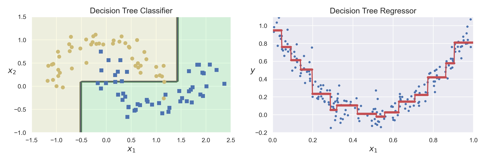

# Supervised Learning Algorithms

## Introduction

*Supervised learning* is the machine learning task of learning a function that maps an input to an output based on example input-output pairs. 
A supervised learning algorithm analyzes the training data and produces an inferred function, which can be used later for mapping new examples.

The most popular supervised learning tasks are: *Regression* and *Classification*.
- The result of solving the *regression* task is a model that can make *numerical predictions*. For example:
  - Real estate value prediction
  - Predicting your company's revenue next year
- The result of solving the *classification* task is a model that can make *classes predictions*. For example:
  - Spam detection
  - Classifying news articles
- The line between these tasks is sometimes fuzzy (predicting the probability of cancer based on blood tests)

|  |
|:--:|
| <b>Classification vs Regression. Image by Author</b>|

Classification algorithms can be also divided to **hard** and **soft**:
- **Hard classification algorithms** predict whether a data point belongs to a particular class **without producing the probability estimation**.
- **Soft classification algorithms** in turn, also estimate the class conditional **probabilities**.

Classification algorithms can be also divided by the number of classes to classify:
- **Binary classification** - only two classes.
- **Multiclass classification** - more than two classes.
  - **Multilabel classification** (Multilabel-multiclass) - multiple classes, but classes are binary (the presence of people in the image). Result - [0, 0, 1] or [1, 0, 1].
  - **Multioutput classification** (Multioutput-multiclass) also known as **multitask classification** - multiple classes, but classes are not binary (predict the number of items). Result - [5, 0, 1] or [7, 0, 0].

Some algorithms are designed only for binary classification problems (*SVM* for example). So, they cannot be used for multi-class classification tasks directly. 
Instead, heuristic methods can be used to split a multi-class classification problem into multiple binary classification datasets and train a binary classification model each:
- **OvR** (one-vs-rest) - sometimes **OvA** (one-vs-all) - you have to train N classifiers for N classes, but on full dataset.
- **OvO** (one-vs-one) - you have to train N*(N-1)/2 classifiers for N classes, but on subsamples from your dataset. Better suited for unbalanced samples.

Next, the following algorithms will be reviewed or mentioned (note, that *all of them solve both classification and regression task*, except of *Linear Regression (only Regression)* and *Logistic Regression (only Classification)*):
- *Linear Regression*
- *Logistic Regression*
- *Support Vector Machines*
- *k-Nearest Neighbors*
- *Decision Tree*
- Ensemble methods:
  - *Bagging* and *Pasting*
  - *Random Forest* and *Extra Trees*
  - *Boosting*
  - *Staking* and *Blending*

# Simple Algorithms

I use the phrase *simple algorithms* not in the sense that they are simply to implement (although some of them really are), but in the fact that these are separate algorithms, not *ensemble learning* that we will see later.

## Linear Regression

In the simplest case, the regression task is to draw a line through the data points so that an error between this line (predictions) and real values is minimal.
In general, this is the problem of *minimizing the loss function*, so *the optimization problem*. Usually, the loss function is the *MSE - mean square error* (because of *maximum likelihood estimation*), and the optimization algorithm is *gradient descent*. Anyway, any other loss function of optimization algorithm can be used.

One of the important properties of linear regression is that optimal parameters (according to *MSE*, again, because of *maximum likelihood estimation*) can be calculated with simple **Normal Equation**. But this method does not scale well with large number of features, so any other optimization method can be applied instead.

If the data dependences is more complex, than a straight line, we can add powers of each feature as new features (*PolynomialFeatures* class from *sklearn* can be used) and then train a Linear Regression model. This technique is called **Polynomial Regression**. Process of creating new features (e.g. x^n, or log(x), e^x etc.) is called *feature engineering* and can significantly increase linear model performance.

Other popular version of this algorithm is **Bayesian Linear Regression**, that predicts not only values, but also it's probabilities, by building a *confidence interval*. This is possible thanks to *Bayes' theorem*.

One of the most efficient way to avoid overfitting and outliers influence with regression is **regularization**. *Regularization term* is added to loss function so regression coefficients have to be as little as possible. 
- **LASSO regression** - implements L1 regularization, + |coeff|.
- **Ridge regression** - implements L2 regularization, + coeff^2. Also known as *Tikhonov regularization*.
- **Elastic Net regression** - implements both L1 and L2 regularization.

Regularized regression can also be used like *feature selection* tool. Thanks to some properties, LASSO regression, for example, can delete insignificant features (set their coefficients to zero).

As mentioned earlier, *linear regression solve only regression task*. 

**Main hyperparameters**:
- *feature engineering* and *feature selection*
- regularization type and parameter
- solver - optimization algorithm

**Pros**:
+ Have few parameters, and learn fast
+ Can be configured using *stochastic gradient descent*, without the need to store all the samples in memory and can be used for *online learning*
+ More interpretable than complex models
+ Is well suited for problems with a small number of data points and large number of features
+ Is well suited for sparse data

**Cons**:
- Poorly restores complex dependencies
- Requires data preprocessing 

## Logistic Regression

Like Linear Regression model, Logistic Regression (is also known as **logit regression**) computes a weighted sum of the input features (plus bias) but instead of outputting this result directly, it outputs the *logistic* of the result.
The *logistic* is a *sigmoid function*, that outputs a number between 0 and 1, so Logistic Regression is **soft binary classifier** that estimates the probability that instance belongs to the positive class.
Depends of some threshold different values of accuracy/recall can be obtained. The same types of regularization as in Linear Regression can be used.

|  |
|:--:|
| <b>Sigmoid Function. [Public Domain](https://en.wikipedia.org/wiki/Sigmoid_function#/media/File:Logistic-curve.svg)</b>|

Very similar **probit regression** uses a little different function - probit function instead of sigmoid.

The Logistic Regression model can be generalized to support multiple classes directly, without training multiple classifiers. This is called **Softmax Regression** (or *Multinomial Logistic Regression*). This model computes a score for each class and then estimates the probability of each class by applying *softmax function* (also called *normalized exponential*).

As mentioned earlier, *logistic regression solve only classification task*. 

Is based on Linear Regression, so inherits all the hyperparameters, pros and cons of this algorithm. What can be noted separately - *high interpretation* level of this algorithm, so it is usually widely used in *credit scoring* tasks and *medical diagnostics*.

## Support Vector Machines

Support Vector Machines algorithm is based on *support vectors* concept - the extreme points (circled in black in the image).  
In case of *classification task* it tries to draw a separating line between classes such that *support vectors* are located as far as possible from this line (separating hyperplane in general case):
- *Hard Margin Classification* - it is assumed that instances of the same class are on the same side of the separating hyperplane without exceptions.
- *Soft Margin Classification* - allows violation of the decision boundary, which is regulated by the regularization parameter.

In case of *regression task*, instead, it tries to draw a line to fit as many instances as possible inside the border, "on the street".

|  |
|:--:|
| <b>Support Vectors. [Public Domain](https://en.wikipedia.org/wiki/Support-vector_machine#/media/File:SVM_margin.png)</b>|

Since SVM requires calculating distances between points it also requires *feature scaling*.

The most important and mathematically elegant feature of SVM is that the solution of the *Dual Problem* (which is the basis of SVM) does not depend on the features directly (as vectors), but *only on their pairwise scalar products*.
This allows us to replace the scalar product with a certain function *k(a, b)*, which is called the *kernel*. In fact, the kernel is a *scalar product in some other space*. This procedure allows you to build nonlinear classifiers (which are actually linear in a larger dimension space) without adding new features and is called **kernel trick**.

The use of different kernels allows this algorithm to recover very complex dependencies in both *classification* and *regression* tasks. The most popular kernels are:
- polynomial
- RBF - Gaussian Radial Basis Function
- sigmoid and others

|  |
|:--:|
| <b>SVM with different kernels and default parameters. Image by Author</b>|

One-class SVM also can be used for the *Anomaly Detection* problem.

**Main hyperparameters**:
- kernel type
- regularization parameter C - a penalty for each misclassified data point (usually 0.1 < C < 100)
- regularization parameter gamma - controls regions separating different classes. Large gamma - too specific class regions (overfitting). (usually 0.0001 < gamma < 10)

**Pros**:
+ One of the most powerful and flexible models
+ As linear model inherits the pros of linear regression

**Cons**:
- Requires data preprocessing
- It scales well with number of features, but not samples, so works well only on small and medium-sized datasets

## k-Nearest Neighbors

The nearest neighbor algorithm, as a representative of *metric methods*, makes two hypotheses about the data distribution:
- Continuity hypothesis for *regression* - close objects correspond to close answers, and
- Compactness hypothesis for *classification* - close objects correspond to the same class.

For a new object we have to find k nearest neighbors. Definition of *nearest* depends on the distance metric that we want to use (Manhattan, Euclidean etc.).

|  |
|:--:|
| <b>k-Nearest Neighbors algorithm. The result may differ depending on k. [Public Domain](https://en.wikipedia.org/wiki/K-nearest_neighbors_algorithm#/media/File:KnnClassification.svg)</b>|

The most important hyperparameter is number of neighbors - k. A good initial approximation of k is to set *k to square root of data points number*, but, of course, k can be found with *Cross Validation*. *Classification* then is computed from a simple majority vote of the nearest neighbors of each point, *regression* - from a mean value of the nearest neighbors of each point.

**Main hyperparameters**:
- k - number of neighbors
- distance metric

**Pros**:
+ *Lazy learning* - we just have to load data in memory
+ Simple interpretation
+ Simple realization

**Cons**:
- Requires data preprocessing
- Poorly restores complex dependencies (classification for highly overlapping data)
- As any *metric algorithm* works badly with sparse high-dimensional data
- As any *instance-based algorithm* have to store all train data in memory

## Decision Trees

At each step, the train set is divided into two (or more) parts, depending on a particular choice. Usually these algorithms are *greedy*, that means, that they are looking for a *local* optimal solution at a specific step. 
The popular algorithms for building trees are: 
- **ID3** (one of the oldest algorithm, *Iterative Dichotomiser 3* was invented by *Ross Quinlan*), 
- **C4.5, C5.0** (an extensions of ID3 algorithm, they were developed by the same person and consists in *pruning* the tree after using ID3), 
- **CART** (*Classification And Regression Tree* is optimized for both classification (*Gimi Inpurity* as measure) and regression (*MSE* as measure) trees and is implemented in scikit-learn).

|  |
|:--:|
| <b>Decision Tree Classifier and Regressor. Image by Author</b>|

|  |
|:--:|
| <b>Decision Tree Structure using the example Decision Tree Classifier above. Image by Author</b>|

Different measures for calculating *information gain* can be used. Then decision tree algorithm use information gain to split a particular node:
- *Entropy* - measure of disorder.
- *Gini Impurity*.

The so-called **decision tree pruning** shows itself better than simply limiting the length of the tree. This is the procedure when we build a tree of full depth, after that we remove insignificant nodes of the tree. However, this process is more resource-intensive.

**Main hyperparameters**:
- maximum depth of the tree - the less the less overfitting, usually 10-20
- minimum number of objects in a leaf - the greater the less overfitting, usually 20+

**Pros**:
+ Simple interpretation
+ Simple realization
+ Computational simplicity
+ Does not require features preprocessing and can handle with missing values
+ Feature importance can be calculated using information gain

**Cons**:
- Unstable and variable (investigation of greedy algorithm) - a small change in the input data can completely change the structure of the tree
- High sensitivity to the content of the training set and noise
- Poorly restores complex (non-linear) dependencies
- The tendency to overfitting at a large depth of the tree
- Unlike linear models, they are not extrapolated (they can only predict the value in the range from the minimum to the maximum value of train set)

# Ensemble Methods

Ensemble methods (also **ensemble learning**) are techniques that create multiple models and then combine them to produce improved results. Ensemble methods usually produces more accurate solutions than a single model would.

## Bagging

**Bagging** stands for *bootstrap aggregating*.

When we have a train set `X_train (N x M) N data points and M features` then we train `n` trees on `X`, where `X (N x M)` is a random subsample of `X_train` with the same size.
When `X` is formed **with replacement** algorithm is called **bagging**, and when `X` is formed **without replacement** algorithm is called **pasting**.
When this model does prediction, really, it gets `n` predictions from `n` different models and aggregates them.
*Classification* is computed from a simple majority vote of the models and *regression* is computed from a mean value of the models' predictions.

|  |
|:--:|
| <b>Bagging. Image by Author</b>|

**Pasting** was originally designed for **large datasets**, when computing power is limited. **Bagging**, on the other hand, can use the same subsets many times, which is great for smaller sample sizes, in which it improves robustness.

This approach allows **to leave the same bias, but decrease the variance** thanks to *Central Limit Theorem*.
The more variable the algorithms are, the lower the correlation of their predictions and, accordingly, the CLT works better (decision trees are a great choice).

If we are using bagging, there is a chance that a sample would never be selected, while others may be selected multiple times. In general, for a big dataset, 37% of its samples are never selected and we could use it to test our model. This is called **Out-of-Bag scoring**, or **OOB Scoring**.

**Main hyperparameters**:
- type of models
- n_estimators - the number of models in the ensemble
- max_samples - the number of samples to take from train set to train each base model
- max_features - the number of features to take from train set to train each base model

**Pros**:
+ Very good quality
+ Training process can be simply parallelized because models learns independently from each other
+ Does not require features preprocessing and built-in assessment of the importance of features (in case of trees)
+ Resistant to overfitting
+ Resistant to outliers
+ *OOB Scoring* allows to use full dataset without splitting it into train and validation

**Cons**:
- Complexity of interpretation
- Does not cope well with a very large number of features or for sparse data
- Trains and makes predictions significantly slower than linear models

## Random Forest

Despite the fact that *bagging* can be applied with all types of algorithms, **bagging over decision trees** has become widespread. Since they are unstable and variable, a good result is obtained. In fact, **random forest** is **bagging over decision trees with random subspace method**.

When we have train set `X_train N x M (N data points and M features)` then we train `n` trees on `X`, where `X (N x m)` is random subsample of `X_train` with replacement, but we also take a random subset of the `m (m < M)` features. This is called the *Random Subspace Method*.
When this model does prediction, really, it gets `n` predictions from `n` different models and aggregates them.
*Classification* is computed from a simple majority vote of the models and *regression* is computed from a mean value of the models' predictions.

This approach allows **to leave the same bias, but decrease the variance** thanks to *Central Limit Theorem*.

As known **Isolation Forest** algorithm also can be used for the *Anomaly detection* problem.

**Inherits the pros and cons of bagging**.

**Main hyperparameters**:
- n_estimators - the number of trees in the ensemble - the more the better
- max_features - the number of features to draw from train set to train each base tree - `n/3` for regression and `sqrt(n)` for classification is recommended
- max_depth - the maximum depth of the tree
- min_sample_leaf - the minimum number of samples required to split an internal node

## Extra Trees

Extra Trees is related to the widely used random forest algorithm. 

- **Unlike bagging and random forest** that trains each decision tree from a bootstrap sample of the training dataset, the *Extra Trees* algorithm trains each decision tree on the **whole training dataset**.
- **Like random forest**, the *Extra Trees* algorithm will **randomly sample the features** at each split point of a decision tree. 
- **Unlike random forest**, which uses a greedy algorithm to select an optimal split point, the *Extra Trees* algorithm **randomly selects a split point**.

It can often achieve **as good or better performance than the random forest algorithm**, although it uses a simpler algorithm to construct the decision trees used as members of the ensemble, so **it works faster**. 

**Inherits all hyperparameters, the pros and cons of random forest**.

## Boosting

A boosting is **an ensemble of weak algorithms** (the prediction accuracy is slightly better than random) that are trained **sequentially and each subsequent one considers the error of the previous one**.

|  |
|:--:|
| <b>Boosting. Image by Author</b>|

The general idea of boosting can be implemented in different ways. Three the most popular types of boosting are:
- **AdaBoost**
 
  AdaBoost stands for *Adaptive Boosting*. This is a greedy iterative algorithm. At each step it identifies misclassified data points and adjusts the weights to minimize the training error.  
  This version of boosting is sensitive to outliers.

- **Gradient Boosting**
 
  Gradient Boosting is also called *Gradient Boosting Machine - GBM*. As any boosting implementation, at each step, this algorithm tries to minimize the errors made in the previous steps. But instead of changing the weights (like AdaBoost), GBM trains the next model on the residual errors of its predecessor.
  One of the implementations of GDM is [LightGBM](https://lightgbm.readthedocs.io/en/latest/).

- **XGBoost**
 
  [XGBoost](https://xgboost.readthedocs.io/en/latest/index.html) stands for *eXtreme Gradient Boosting*. This implementation was designed for speed and performance - it works parallel with GPU and Hadoop.
  [XGBFIR](https://github.com/limexp/xgbfir) is a great library for XGBoost feature importance analysis.

Since the main implementations of boosting still use decision trees as basic models, boosting, like random forest, determines the importance of features. But the popularity of the boosting creates a lot of libraries that allows you to do more detailed analysis (for example XGBFIR library allows you to analyse not one feature importance, but also their double and even triple combinations).

**Main hyperparameters**:
- Types of models and ways of their interaction with each other

**Pros**:
+ Very good quality, usually better than random forest
+ Built-in assessment of the importance of features

**Cons**:
- Learning is slower than random forest, because learning process has to be strictly sequential (although the implementations like XGBoost or LightGBM can argue with this)
- Prone to overfitting
- Works well only with sufficiently large datasets

## Staking

The architecture of a stacking model involves **two or more base models**, often referred to as *level-0 models*, and a **meta-model that combines the predictions of the base models**, referred to as a *level-1 model*.
- *Level-0 Models (Base-Models)*: Training data is divided into `K` folds. Then `K` models train on the `K-1` folds each.
- *Level-1 Model (Meta-Model)*: Model that learns how to combine the predictions of the base models in the best possible way.

|  |
|:--:|
| <b>Staking. Image by Author</b>|

Differences from boosting:
- **Unlike bagging**, in stacking, the **models are typically different** (e.g. not all decision trees).
- **Unlike boosting**, in stacking, **a single model is used to learn how to best combine the predictions from the contributing models** (e.g. instead of a sequence of models that correct the predictions of prior models).

The usage of a simple linear model as the meta-model often gives stacking the colloquial name **blending**.

**Main hyperparameters**:
- Types of models and ways of their interaction with each other

**Pros**:
+ Improves the quality of the model when nothing else helps
+ Allows you to effectively mix models of different classes, combining their strengths
+ Help you win gold on Kaggle

**Cons**:
- High computational complexity 
- Complexity of interpretation
- Сan easily overfit with information leak
- Works well only on sufficiently large datasets

## Conclusions

The most popular supervised learning algorithms were described here (of course, there are others). As a conclusion, I want to describe the process of choosing an algorithm to solve a typical supervised learning task (classification or regression). It's very simple - you just need to answer two questions.

Is your data sparse? If yes, then you will have to use linear methods. This is usually an *SVM*, and with different kernels it will allow you to restore complex dependencies. Remember that linear methods require data preprocessing, which can be problematic in some cases.

If your data is dense, then you are more lucky. Now everything depends on their amount. If there are a lot of them, then use a *boosting*, otherwise - *random forest*. Both of these algorithms are powerful, resistant to noise and will show you a good quality, but they will take a long time to learn and predict. Also, remember that boosting is prone to overfitting.

|  |
|:--:|
| <b>Block diagram for algorithm selection. Image by Author</b>|

What does *a lot of data* mean? How much is it? Usually talk about a threshold value of *100 thousand samples*, but in any case, you can (and most likely will) try different algorithms.

This is just a recommendation, and you should try different algorithms with different hyperparameters to solve your task in the best way.