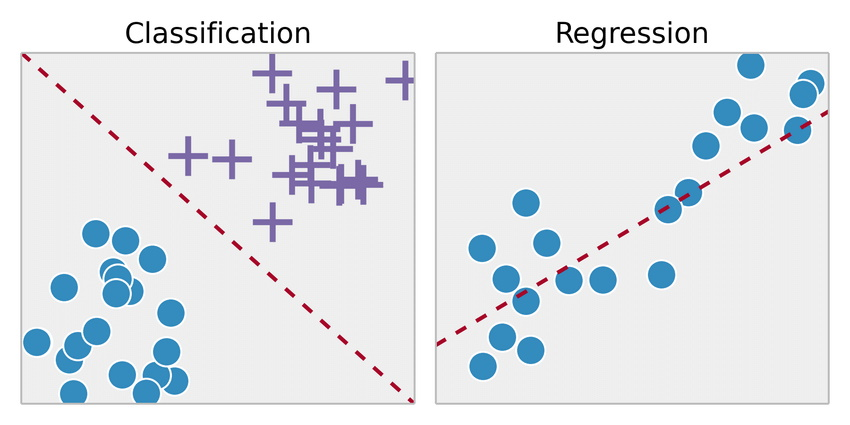

# Supervised Learning Algorithms

*Supervised learning* is the machine learning task of learning a function that maps an input to an output based on example input-output pairs. 
A supervised learning algorithm analyzes the training data and produces an inferred function, which can be used later for mapping new examples.

The most popular supervised learning tasks are: *Regression* and *Classification*.
- The result of solving the *regression* task is a model that can make *numerical predictions*. For example:
  - Real estate value prediction
  - Predicting your company's revenue next year
- The result of solving the *classification* task is a model that can make *classes predictions*. For example:
  - Spam detection
  - Classifying news articles
- The line between these tasks is sometimes fuzzy (predicting the probability of cancer based on blood tests)

|  |
|:--:|
| <b>Classification vs Regression. Image by Yves Matanga</b>|

Classification algorithms can be also divided to **hard** and **soft**:
- **Hard classification algorithms** predict whether a data point belongs to a particular class **without producing the probability estimation**.
- **Soft classification algorithms** in turn, also estimate the class conditional **probabilities**.

Classification algorithms can be also divided by the number of classes to classify:
- **Binary classification** - only two classes.
- **Multiclass classification** - more than two classes.
  - **Multilabel classification** (Multilabel-multiclass) - multiple classes, but classes are binary (the presence of people in the image). Result - [0, 0, 1] or [1, 0, 1].
  - **Multioutput classification** (Multioutput-multiclass) also known as **multitask classification** - multiple classes, but classes are not binary (predict the number of items). Result - [5, 0, 1] or [7, 0, 0].

Some algorithms are designed only for binary classification problems (*SVM* for example). So, they cannot be used for multi-class classification tasks directly. 
Instead, heuristic methods can be used to split a multi-class classification problem into multiple binary classification datasets and train a binary classification model each:
- **OvR** (one-vs-rest) - sometimes **OvA** (one-vs-all) - you have to train N classifiers for N classes, but on full dataset.
- **OvO** (one-vs-one) - you have to train N*(N-1)/2 classifiers for N classes, but on subsamples from your dataset. Better suited for unbalanced samples.

Next, the following algorithms will be reviewed or mentioned (note, that *all of them solve both classification and regression task*, except of *Linear Regression (only Regression)* and *Logistic Regression (only Classification)*):
- *Linear Regression*
- *Logistic Regression*
- *Support Vector Machines*
- *k-Nearest Neighbors*
- *Decision Tree*
- Ensemble methods:
  - *Bagging* and *Pasting*
  - *Random Forest* and *Extra Trees*
  - *Boosting*
  - *Staking* and *Blending*