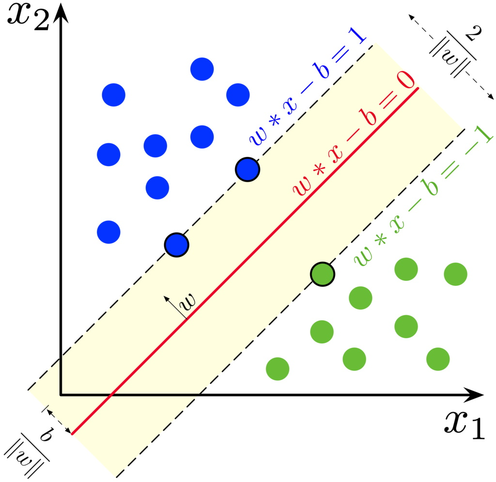
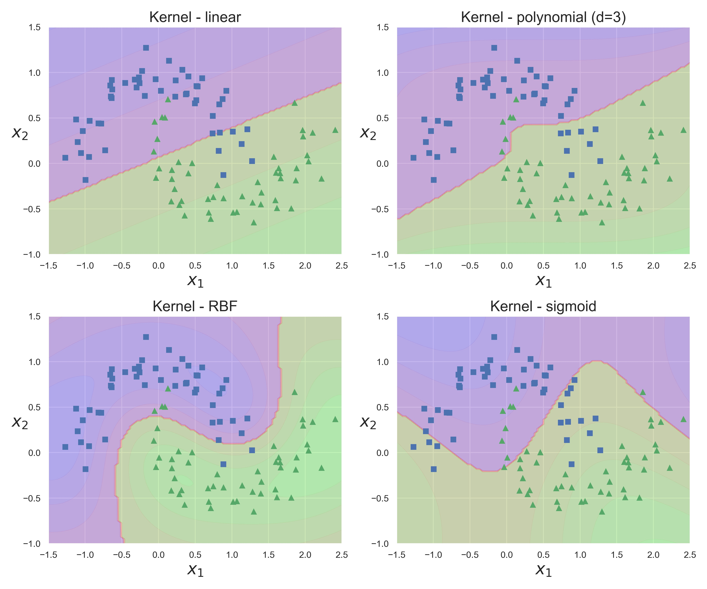

## Support Vector Machines

Support Vector Machines algorithm is based on *support vectors* concept - the extreme points (circled in black in the image).  
In case of *classification task* it tries to draw a separating line between classes such that *support vectors* are located as far as possible from this line (separating hyperplane in general case):
- *Hard Margin Classification* - it is assumed that instances of the same class are on the same side of the separating hyperplane without exceptions.
- *Soft Margin Classification* - allows violation of the decision boundary, which is regulated by the regularization parameter.

In case of *regression task*, instead, it tries to draw a line to fit as many instances as possible inside the border, "on the street".

|  |
|:--:|
| <b>Support Vectors. Image from Wikipedia</b>|

Since SVM requires calculating distances between points it also requires *feature scaling*.

The most important and mathematically elegant feature of SVM is that the solution of the *Dual Problem* (which is the basis of SVM) does not depend on the features directly (as vectors), but *only on their pairwise scalar products*.
This allows us to replace the scalar product with a certain function *k(a, b)*, which is called the *kernel*. In fact, the kernel is a *scalar product in some other space*. This procedure allows you to build nonlinear classifiers (which are actually linear in a larger dimension space) without adding new features and is called **kernel trick**.

The use of different kernels allows this algorithm to recover very complex dependencies in both *classification* and *regression* tasks. The most popular kernels are:
- polynomial
- RBF - Gaussian Radial Basis Function
- sigmoid and others

|  |
|:--:|
| <b>SVM with different kernels and default parameters</b>|

One-class SVM also can be used for the *Anomaly Detection* problem.

**Main hyperparameters**:
- kernel type
- regularization parameter C - a penalty for each misclassified data point (usually 0.1 < C < 100)
- regularization parameter gamma - controls regions separating different classes. Large gamma - too specific class regions (overfitting). (usually 0.0001 < gamma < 10)

**Pros**:
+ One of the most powerful and flexible models
+ As linear model inherits the pros of linear regression

**Cons**:
- Requires data preprocessing
- It scales well with number of features, but not samples, so works well only on small and medium-sized datasets