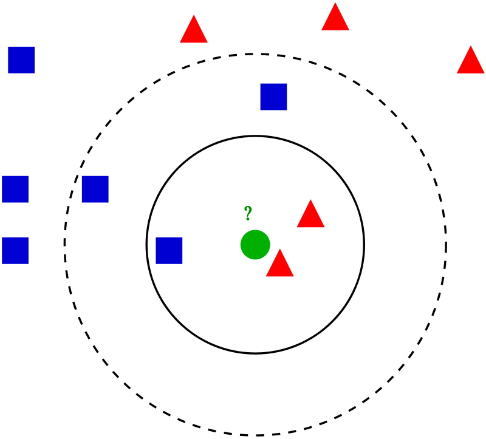

## k-Nearest Neighbors

The nearest neighbor algorithm, as a representative of *metric methods*, makes two hypotheses about the data distribution:
- Continuity hypothesis for *regression* - close objects correspond to close answers, and
- Compactness hypothesis for *classification* - close objects correspond to the same class.

For a new object we have to find k nearest neighbors. Definition of *nearest* depends on the distance metric that we want to use (Manhattan, Euclidean etc.).

|  |
|:--:|
| <b>k-Nearest Neighbors algorithm. The result may differ depending on k. [Public Domain](https://en.wikipedia.org/wiki/K-nearest_neighbors_algorithm#/media/File:KnnClassification.svg)</b>|

The most important hyperparameter is number of neighbors - k. A good initial approximation of k is to set *k to square root of data points number*, but, of course, k can be found with *Cross Validation*. *Classification* then is computed from a simple majority vote of the nearest neighbors of each point, *regression* - from a mean value of the nearest neighbors of each point.

**Main hyperparameters**:
- k - number of neighbors
- distance metric

**Pros**:
+ *Lazy learning* - we just have to load data in memory
+ Simple interpretation
+ Simple realization

**Cons**:
- Requires data preprocessing
- Poorly restores complex dependencies (classification for highly overlapping data)
- As any *metric algorithm* works badly with sparse high-dimensional data
- As any *instance-based algorithm* have to store all train data in memory
