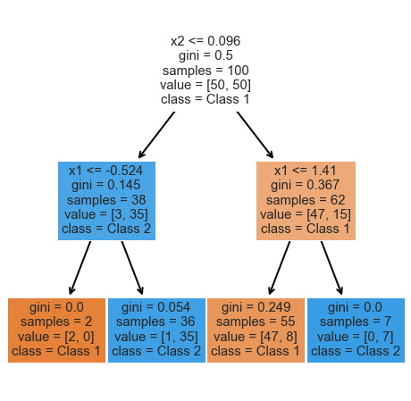

## Decision Trees

At each step, the train set is divided into two (or more) parts, depending on a particular choice. Usually these algorithms are *greedy*, that means, that they are looking for a *local* optimal solution at a specific step. 
The popular algorithms for building trees are: 
- **ID3** (one of the oldest algorithm, *Iterative Dichotomiser 3* was invented by *Ross Quinlan*), 
- **C4.5, C5.0** (an extensions of ID3 algorithm, they were developed by the same person and consists in *pruning* the tree after using ID3), 
- **CART** (*Classification And Regression Tree* is optimized for both classification (*Gimi Inpurity* as measure) and regression (*MSE* as measure) trees and is implemented in scikit-learn).

|  |
|:--:|
| <b>Decision Tree Classifier and Regressor</b>|

|  |
|:--:|
| <b>Decision Tree Structure using the example Decision Tree Classifier above</b>|

Different measures for calculating *information gain* can be used. Then decision tree algorithm use information gain to split a particular node:
- *Entropy* - measure of disorder.
- *Gini Impurity*.

The so-called **decision tree pruning** shows itself better than simply limiting the length of the tree. This is the procedure when we build a tree of full depth, after that we remove insignificant nodes of the tree. However, this process is more resource-intensive.

**Main hyperparameters**:
- maximum depth of the tree - the less the less overfitting, usually 10-20
- minimum number of objects in a leaf - the greater the less overfitting, usually 20+

**Pros**:
+ Simple interpretation
+ Simple realization
+ Computational simplicity
+ Does not require features preprocessing and can handle with missing values
+ Feature importance can be calculated using information gain

**Cons**:
- Unstable and variable (investigation of greedy algorithm) - a small change in the input data can completely change the structure of the tree
- High sensitivity to the content of the training set and noise
- Poorly restores complex (non-linear) dependencies
- The tendency to overfitting at a large depth of the tree
- Unlike linear models, they are not extrapolated (they can only predict the value in the range from the minimum to the maximum value of train set)
