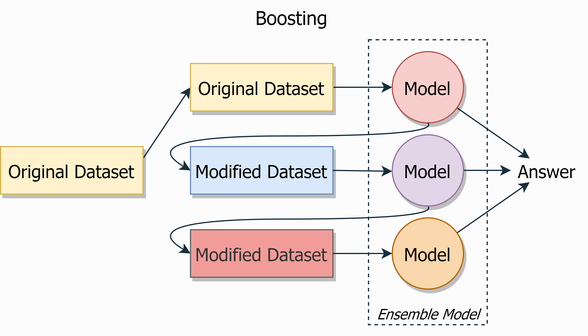

## Boosting

A boosting is **an ensemble of weak algorithms** (the prediction accuracy is slightly better than random) that are trained **sequentially and each subsequent one considers the error of the previous one**.

|  |
|:--:|
| <b>Boosting. Image by Author</b>|

The general idea of boosting can be implemented in different ways. Three the most popular types of boosting are:
- **AdaBoost**
 
  AdaBoost stands for *Adaptive Boosting*. This is a greedy iterative algorithm. At each step it identifies misclassified data points and adjusts the weights to minimize the training error.  
  This version of boosting is sensitive to outliers.

- **Gradient Boosting**
 
  Gradient Boosting is also called *Gradient Boosting Machine - GBM*. As any boosting implementation, at each step, this algorithm tries to minimize the errors made in the previous steps. But instead of changing the weights (like AdaBoost), GBM trains the next model on the residual errors of its predecessor.
  One of the implementations of GDM is [LightGBM](https://lightgbm.readthedocs.io/en/latest/).

- **XGBoost**
 
  [XGBoost](https://xgboost.readthedocs.io/en/latest/index.html) stands for *eXtreme Gradient Boosting*. This implementation was designed for speed and performance - it works parallel with GPU and Hadoop.
  [XGBFIR](https://github.com/limexp/xgbfir) is a great library for XGBoost feature importance analysis.

Since the main implementations of boosting still use decision trees as basic models, boosting, like random forest, determines the importance of features. But the popularity of the boosting creates a lot of libraries that allows you to do more detailed analysis (for example XGBFIR library allows you to analyse not one feature importance, but also their double and even triple combinations).

**Main hyperparameters**:
- Types of models and ways of their interaction with each other

**Pros**:
+ Very good quality, usually better than random forest
+ Built-in assessment of the importance of features

**Cons**:
- Learning is slower than random forest, because learning process has to be strictly sequential (although the implementations like XGBoost or LightGBM can argue with this)
- Prone to overfitting
- Works well only with sufficiently large datasets