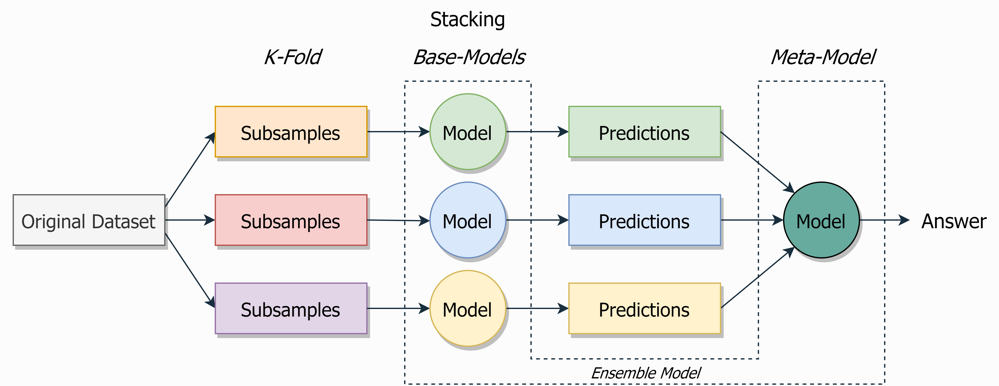

## Stacking

The architecture of a stacking model involves **two or more base models**, often referred to as *level-0 models*, and a **meta-model that combines the predictions of the base models**, referred to as a *level-1 model*.
- *Level-0 Models (Base-Models)*: Training data is divided into `K` folds. Then `K` models train on the `K-1` folds each.
- *Level-1 Model (Meta-Model)*: Model that learns how to combine the predictions of the base models in the best possible way.

|  |
|:--:|
| <b>Stacking. Image by Author</b>|

Differences from boosting:
- **Unlike bagging**, in stacking, the **models are typically different** (e.g. not all decision trees).
- **Unlike boosting**, in stacking, **a single model is used to learn how to best combine the predictions from the contributing models** (e.g. instead of a sequence of models that correct the predictions of prior models).

The usage of a simple linear model as the meta-model often gives stacking the colloquial name **blending**.

**Main hyperparameters**:
- Types of models and ways of their interaction with each other

**Pros**:
+ Improves the quality of the model when nothing else helps
+ Allows you to effectively mix models of different classes, combining their strengths
+ Help you win gold on Kaggle

**Cons**:
- High computational complexity 
- Complexity of interpretation
- Сan easily overfit with information leak
- Works well only on sufficiently large datasets
